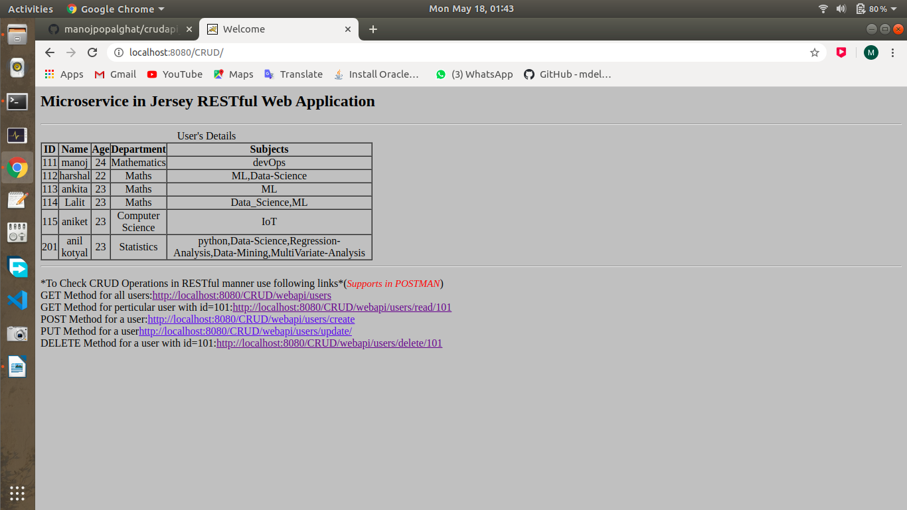
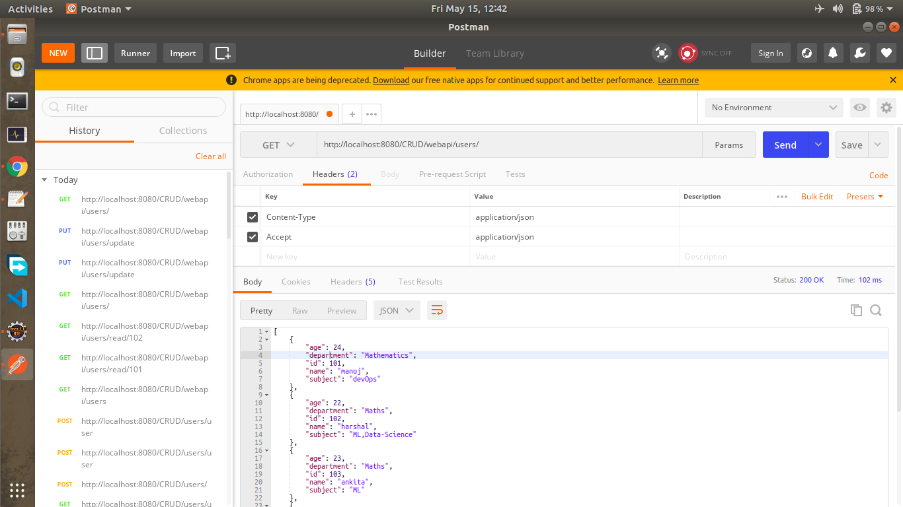
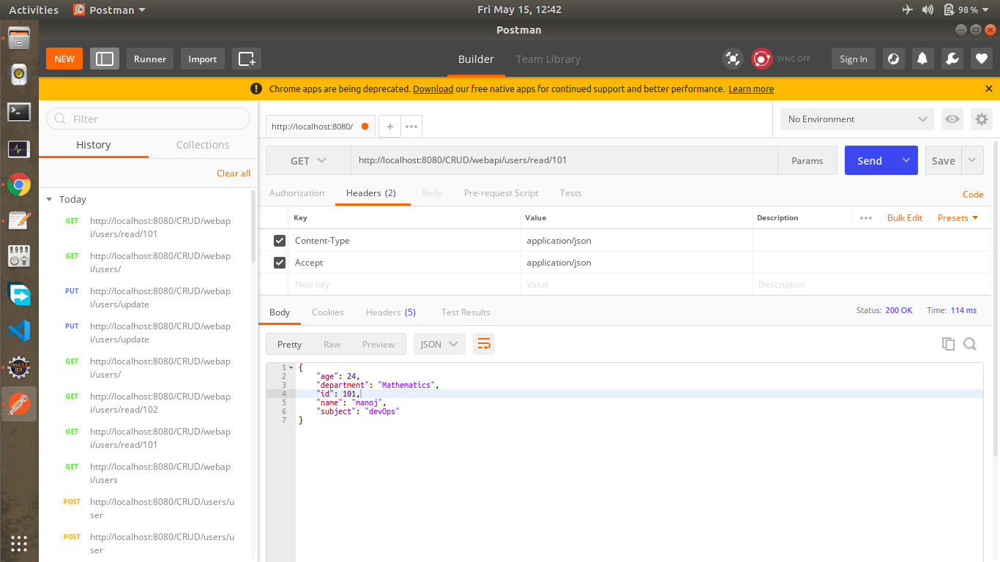
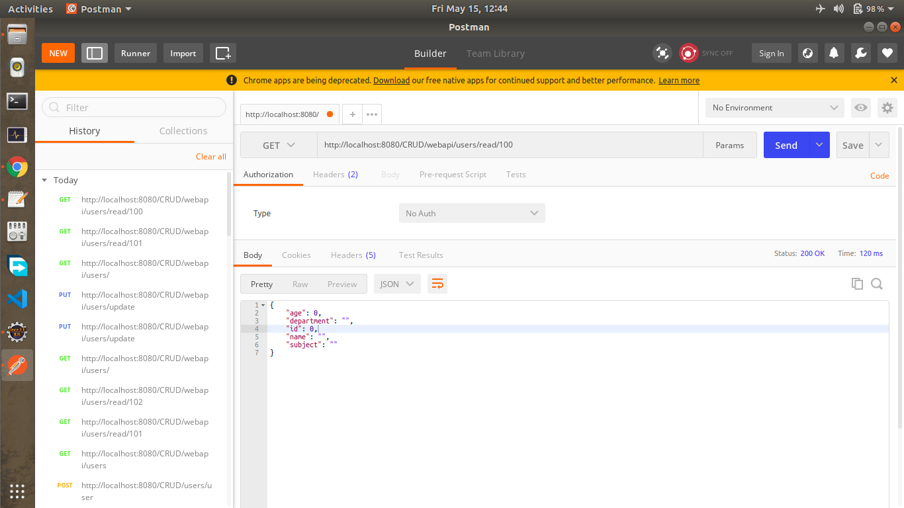
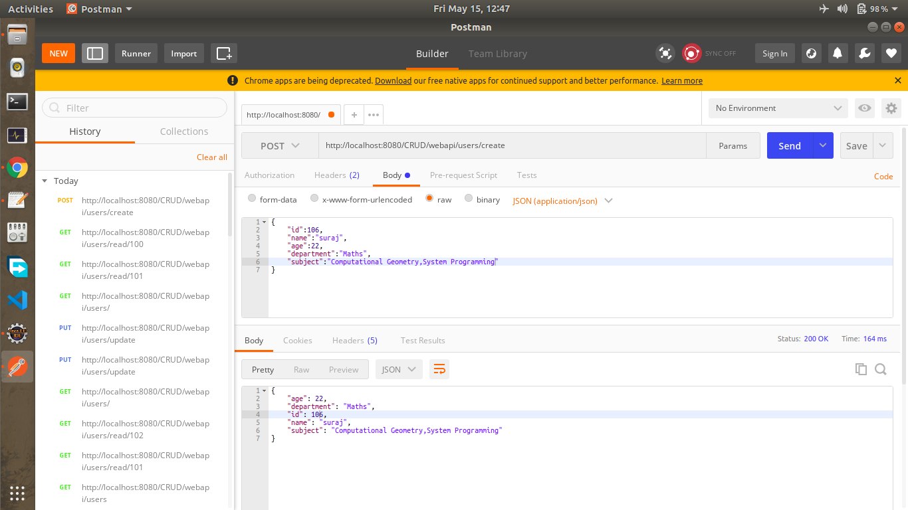
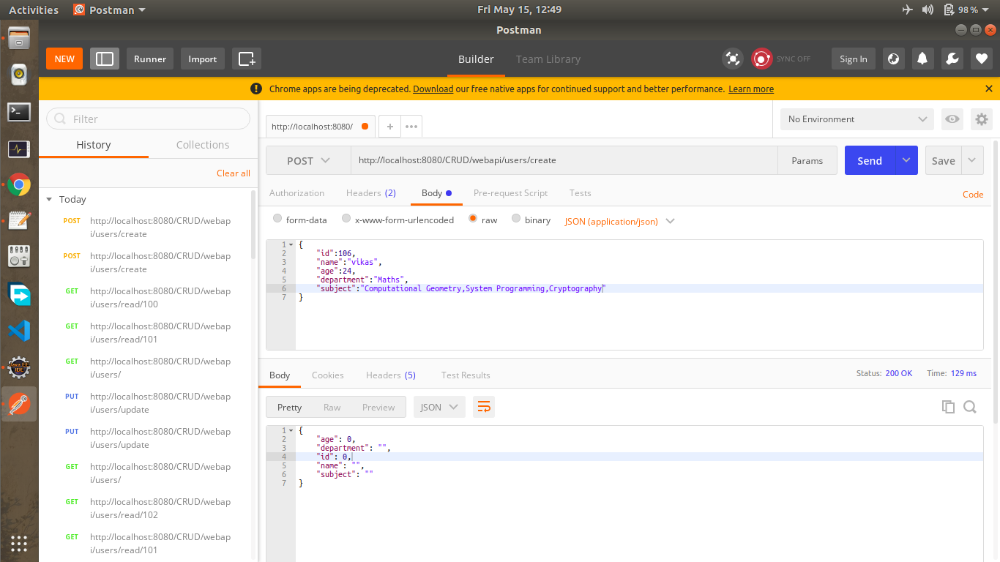
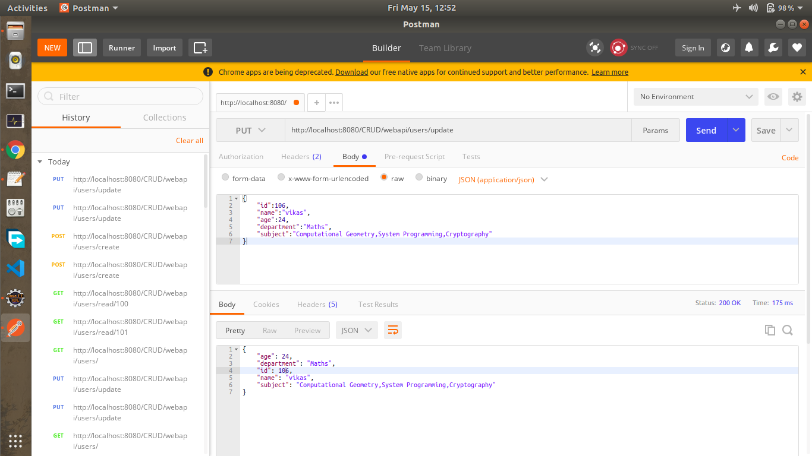
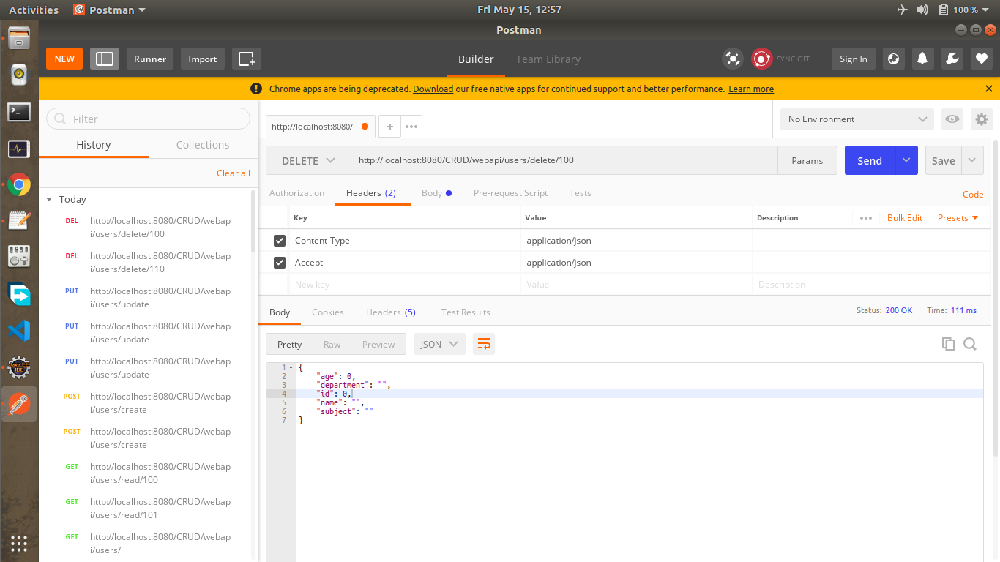

# crudapi_docker
**Implements Micro-services in Jersey web application for CRUD operations on MySql database in RESTful  manner.
Web App contains ‘[UserResource](CRUD/WEB-INF/classes/com/manoj/crud/UserResource.java)’,’[UserRepository](CRUD/WEB-INF/classes/com/manoj/crud/UserRepository.java)’,’[User](CRUD/WEB-INF/classes/com/manoj/crud/User.java)’(POJO) classes which deals with CRUD Operations with MySql Database,
which supports `POST`(Create), `GET` (Read),`PUT` (Update), `DELETE` APIs.**  

User Schema is,  
  User Object  
  {      
       Id : Integer  
       Name : String  
       Age : Integer  
       Department : String  
       Subject : String  
  }  

## Build your docker image
Build image of `manojpopalghat/crudapi_docker` by clone or download Repository ang go to this directory  
and use following shell script  
```shell
docker build -t manojpopalghat/crudapi_docker .
```

## Running your manojpopalghat/CRUD_Docker docker image
use following shell script  
```shell
docker run -d -p 8080:8080 -p 3306:3306 --name=crudapi <image-id>
```
8080 is port of apache-tomcat-server    
3306 is port of mysql-server   

## Explore the Container crudapi
use following shell script  
```shell
docker exec -it crudapi bash
```
## Test Your Deployment
API Testing : (To test APIs install any REST API Client (e.g. Postman))  

_index file(not parsed in Postman)_  
http://localhost:8080/CRUD/  
This shows simply table of Users in Database  



### 1)READ API:
To test the read api, open POSTMAN and enter the following as the request URL.  
http://localhost:8080/CRUD/webapi/users  
Select Method ‘GET’, and enter above request to read all users this will return Array of JSON Objects.



To read user with some id enter below request  
http://localhost:8080/CRUD/webapi/users/read/101  
This will return user’s JSON having given id.



If you entered wrong id then this will return an empty JSON values.  



### 2)CREATE API:
To test the create api, open POSTMAN and enter the following as the request URL.  
http://localhost:8080/CRUD/webapi/users/create  
Select Method ‘POST’ and enter raw JSON data and it will returns entered JSON.  
e.g.   
  {  
       "id":110,  
       "name":"Manoj",  
       "age":24,  
       "department":"Mathematics",  
       "subject":"Dev-Ops"  
  }  
  
  
  
And if the user is alredy present with given id then this will not stored data and returns empty JSON values.  



### 3)UPDATE API:
To test the update api, open POSTMAN and enter the following as the request URL.  
http://localhost:8080/CRUD/webapi/users/update  
Select Method ‘PUT’ and enter raw JSON data to update data (data updated with respect to id)  
and return JSON Object of updated data.  
e.g.  
  {  
       "id":110,  
       "name":"Manoj",  
       "age":24,  
       "department":"Mathematics",  
       "subject":"Docker"  
  }    
  
  
  
If user is not present then it will create a new user.  


### 4)DELETE API:
To test the delete api, open POSTMAN and enter the following as the request URL.  
http://localhost:8080/CRUD/webapi/users/delete/110  
Select Method ‘DELETE’  
i.e. this method deletes user having id 110 and returns user’s JSON having id=110.


And if user is not present with corresponding id then it return empty JSON values.  


  
